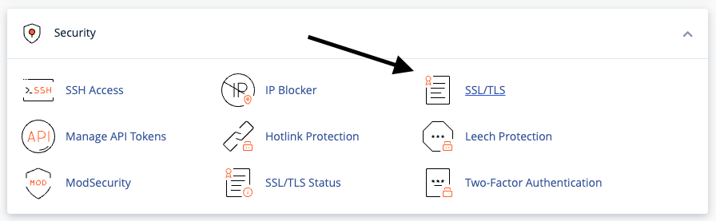
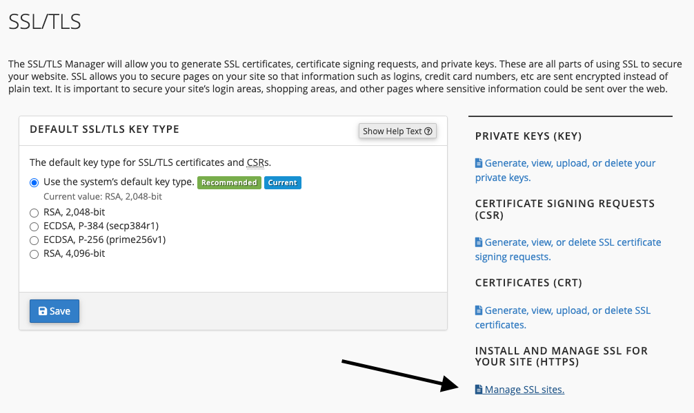
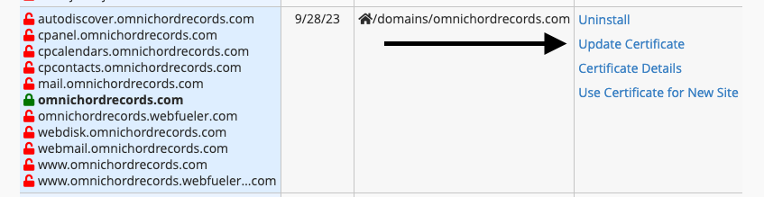
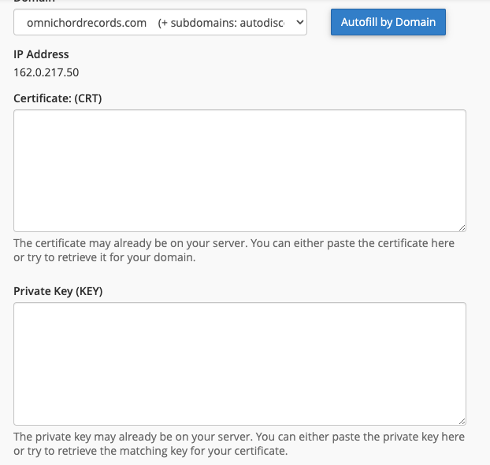

# Add LetsEncrypt SSL to cPanel shared hosting that does not support it
Although LetsEncrypt provides a [cPanel plugin](https://docs.cpanel.net/knowledge-base/third-party/the-lets-encrypt-plugin/),
probably most of the shared hosting providers will want to sell you their own SSLs, and won't install this plugin.
This article serves as a reminder for me on how I did it on my own shared hosting.

## Step 1: have a machine with `certbot`
If don't have already [certbot](https://certbot.eff.org/) installed on one of your machines, you need to install it.
You can find instructions on how to install it at their page [here](https://certbot.eff.org/instructions). You can select
`other` on the first option, and then select the OS that you want to install it in - in my case, I've installed it
in a Debian virtual machine that I have running at home.

## Step 2: generate the certificate
For this step, you'll need to run the following command:
```bash
certbot certonly --manual --preferred-challenges=dns -d omnichordrecords.com
```
In my case, I was generating an SSL for [Omnichord Records](https://omnichordrecords.com) domain, with DNS challenge.
This will require you to edit the DNS records on your domain, and add a TXT record. Instructions will be shown during the
`certbot` generation process.

> Important!
>
> There's step during the generation process, where `certbot` will check if your DNS record is available.
> Before procedding to this step, make sure that you've edited and added the TXT record, wait a few minutes
> or use a tool like [Dig](https://toolbox.googleapps.com/apps/dig/#TXT/_acme-challenge.omnichordrecords.com) to check
> if the TXT record has propagated.

## Step 3: install certificate in cPanel
The previous command should have generated `privkey.pem` and `cert.pem`.
Copy those file contents and paste them in cPanel:

- SSL / TLS Sites



- Manage SSL Sites



- Update Certificate



- Certificate Form



Hit `Install Certificate` button and you're done.

- [Go back](./index.md)
- [Go back home](../index.mdx)
