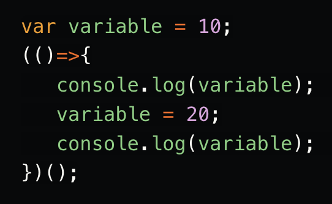

# Welcome to my personal website

I'm a web developer, passionate by innovation and user experience. I have been working in web development for quite a few time now, but last years I have been focused in frontend development.

Currently my favourite tech stack is React with TypeScript, making use of MobX and InversifyJS to achieve better abstractions on bigger projects.
For CI / CD I usually use Jenkins and have build a number of CI flows to help our teams to deliver code, both in backend and frontend projects.
Learning new technologies is something that I love to do, so I am always happy to research and experiment with new ones, mainly in the Javascript world :)

On my free time I swim, I play the guitar, I repair and drive my old cars, I hang out with my family and I take some pictures.

Thanks for stopping by!

Check more [about me](about.md).

Get started with my [blog](blog/getting-started.md).
